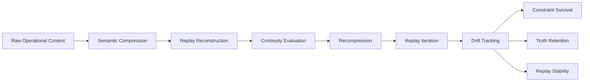
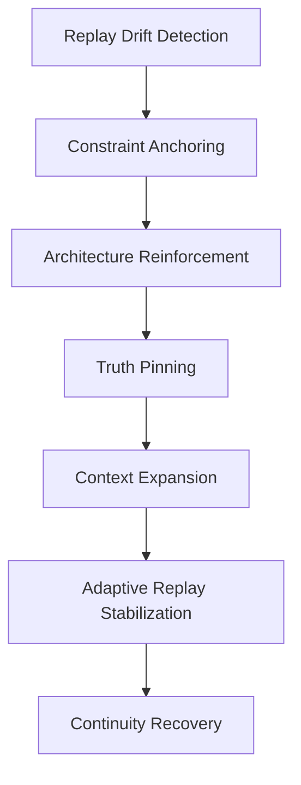
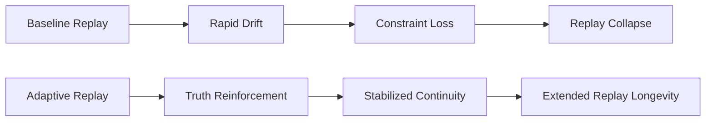
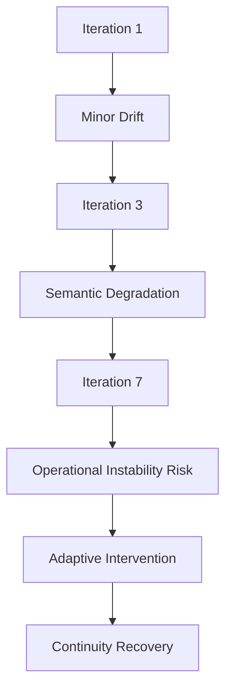
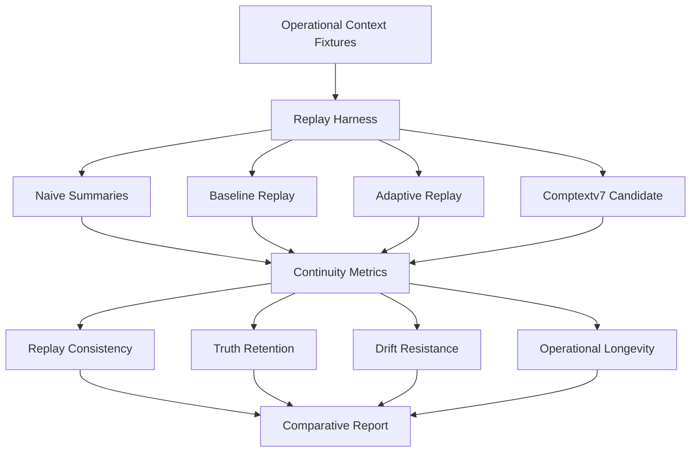

<div align="center">

# CompText Daimler Experiment

```text
╔══════════════════════════════════════════════════════════════════════════════╗
║                         SEMANTIC REPLAY CONTINUITY                         ║
║              Operational Memory Evaluation · Deterministic Replay           ║
╚══════════════════════════════════════════════════════════════════════════════╝
```

### Semantic Replay Continuity + Operational Memory Evaluation Framework

**Investigating whether operational reasoning continuity survives repeated semantic compression and replay cycles.**

CompText Daimler Experiment is a deterministic research sandbox for measuring how operational context behaves when it is compressed, reconstructed, recompressed, and replayed across multiple iterations. The repository frames compression as an auditable memory transformation problem rather than a generic summarization shortcut.


</div>

---

## Positioning

This project has evolved from a compression experiment into a **semantic replay continuity** and **operational memory evaluation** framework.

The central research question is narrow and measurable:

> When an operational context is repeatedly compressed, replayed, and evaluated, which facts, constraints, goals, and architectural relationships remain usable — and where does continuity degrade?

The repository does **not** claim solved long-term memory, universal semantic compression, or production-ready agent memory. It provides deterministic harnesses, synthetic fixtures, replay metrics, and report artifacts that make semantic degradation easier to inspect.

---

## Core Idea

Traditional compression and summarization pipelines can reduce token load, but repeated use in agentic systems introduces memory risks:

| Risk | Typical Failure Pattern | Operational Impact |
|---|---|---|
| Continuity loss | summaries preserve topic but lose task state | the agent forgets what must remain true |
| Constraint collapse | rules, assumptions, and boundaries are weakened | later decisions violate earlier constraints |
| Semantic drift | reconstructed context becomes plausible but less precise | repeated cycles amplify small distortions |
| Detail erosion | identifiers, dependencies, and ordering disappear | replay becomes insufficient for real work |

CompText explores a more testable loop:

- **Semantic replay chains** that repeatedly reconstruct and recompress operational state.
- **Adaptive stabilization** that reacts to drift signals with anchoring interventions.
- **Truth anchoring** for facts expected to survive replay.
- **Replay recovery** for restoring continuity after degradation is detected.
- **Operational continuity retention** as the primary measurement target.

The project treats compression as a controlled transformation: every replay step should leave behind enough evidence for measurement, regression comparison, and failure analysis.

---

## Replay Chain Lifecycle

A replay chain transforms a raw operational context into a compressed semantic state, reconstructs it, recompresses it, and measures what survives over time.



### What the chain measures

- **Replay degradation:** loss of operationally relevant content after each reconstruction.
- **Drift accumulation:** growth of semantic mismatch across repeated replay cycles.
- **Continuity persistence:** survival of goals, constraints, and architecture over time.
- **Stabilization interventions:** adaptive steps that attempt to reduce drift or restore missing anchors.

The loop is intentionally deterministic where possible so that evaluator changes, fixture changes, and strategy changes can be compared across runs.

---

## Adaptive Stabilization Pipeline

Adaptive replay introduces interventions when drift is detected. The current implementation should be read as an experimental stabilizer, not a complete memory system.



Stabilization is evaluated by checking whether anchored constraints, pinned truths, and operational goals remain available after replay. This can improve continuity scores, but it can also mask weak evaluators if the scoring method is too permissive.

---

## Baseline vs Adaptive Replay



Baseline replay is useful because it exposes how quickly continuity can decay without intervention. Adaptive replay is useful because it tests whether targeted anchors can extend replay longevity without pretending that all semantic detail is preserved.

---

## Semantic Drift Escalation



The expected failure mode is not sudden collapse. It is gradual drift: small omissions, softened constraints, and increasingly generic reconstructions that still look coherent. This is why deterministic replay evaluation is useful — it can reveal degradation before outputs obviously fail.

---

## Real Replay Results

The following values summarize the current replay-evaluation snapshot for the deterministic synthetic setup in this repository. They should be interpreted as early research indicators, not general performance claims.

| Metric | Result |
|---|---:|
| Replay Iterations | 7 |
| Architecture Continuity | 1.0 |
| Constraint Survival | 1.0 |
| Goal Continuity | 1.0 |
| Replay Consistency | 0.833–0.933 |
| Truth Retention | ~0.805 |
| Semantic Drift Growth | ~0.167 |
| Contradiction Count | 0 |

### Adaptive replay metrics

| Adaptive Metric | Result |
|---|---:|
| Adaptive Continuity | ~0.94 |
| Replay Recovery Score | ~0.95 |
| Pinned Truth Retention | ~0.91 |
| Drift Escalation | reduced |

### Interpreting the high scores

Some values are intentionally treated as suspiciously high. Architecture continuity, constraint survival, goal continuity, and contradiction count can look excellent when fixtures are narrow, replay tasks are deterministic, and contradiction detection is heuristic. These results are useful for regression tracking, but they are not yet strong evidence of robust semantic memory.

Planned stricter validation includes adversarial replay prompts, contradiction probes, temporal consistency attacks, external evaluator models, gold-set comparisons, and evaluator calibration against known failure cases.

---

## Important Limitations

This section is central to the project’s credibility.

| Limitation | Current Status | Why It Matters |
|---|---|---|
| Metrics are early-stage | replay metrics are still being refined | scores may not transfer to harder contexts |
| Contradiction detection is heuristic | current checks can miss implied or subtle conflicts | zero contradictions does not prove consistency |
| Adversarial validation is incomplete | replay chains are not yet stress-tested against hostile prompts | robustness remains unproven |
| Semantic evaluation is not externally verified | current scoring is internal to the repository | independent evaluator agreement is still needed |
| Detail fidelity degrades over iterations | specific details can fade even when high-level continuity remains | operational use may require exact identifiers |
| Evaluator can be overly permissive | broad semantic matches may receive high scores | reported continuity can overstate real usefulness |

The framework is designed to expose these weaknesses, not hide them. Any production use would require task-specific gold data, independent evaluation, model governance, and safety review.

---

## Future Comptextv7 Integration

The Daimler experiment repository acts as an evaluation sandbox. Future Comptextv7 work can be introduced as a semantic engine candidate and measured against the same replay-continuity harness.

Future comparisons will benchmark:

- replay consistency across repeated reconstruction cycles;
- drift resistance under longer replay chains;
- truth retention for pinned operational facts;
- operational longevity before context becomes unreliable.



| System | Replay Consistency | Truth Retention | Drift Resistance |
|---|---:|---:|---:|
| Naive Summaries | TBD | TBD | TBD |
| Baseline Replay | TBD | TBD | TBD |
| Adaptive Replay | TBD | TBD | TBD |
| Comptextv7 | TBD | TBD | TBD |

---

## Repository Map

```text
.
├── api.py                         # FastAPI surface for compression, triage, analysis, benchmarks
├── render_app.py                  # Render/static showcase entrypoint
├── src/
│   ├── agents/                    # intake, triage, analysis agents
│   ├── core/                      # KVTC strategies, cache, OBD database
│   ├── models/                    # Pydantic/domain schemas
│   └── telemetry.py               # aggregate metrics exporter
├── tests/                         # unit and API behavior tests
├── scripts/                       # benchmark, sanitization, regression, smoke-check tooling
├── docs/
│   ├── ARCHITECTURE.md            # architecture and data-flow details
│   ├── BENCHMARK_METHODOLOGY.md   # benchmark design and interpretation
│   ├── BENCHMARK_WORKFLOW.md      # runnable report workflow
│   ├── FORENSIC_REPLAY.md         # replay-oriented validation notes
│   └── reports/                   # generated synthetic report artifacts
├── showcase/                      # React/Vite visual showcase
└── archive/                       # historical reports and one-off generated artifacts
```

---

## Quickstart

### 1. Create an environment

```bash
python -m venv .venv
source .venv/bin/activate
pip install -r requirements.txt
pip install -e .
```

### 2. Run the API in deterministic mode

```bash
LLM_BACKEND=mock uvicorn api:app --reload --port 8000
```

### 3. Compress a synthetic diagnostic note

```bash
curl -s http://localhost:8000/compress \
  -H 'Content-Type: application/json' \
  -d '{"text":"Fahrzeug: FIN WDB906232N3123456\nKilometerstand: 124000\nFehlercode: P0300\nBefund: Motorwarnleuchte aktiv"}' | python -m json.tool
```

### 4. Run the full analysis path

```bash
curl -s http://localhost:8000/analyze \
  -H 'Content-Type: application/json' \
  -d '{"quelle":"synthetic-demo","text":"OBD Meldung P0300. Motorwarnleuchte aktiv. Keine Kundendaten verwenden."}' | python -m json.tool
```

### 5. Run deterministic checks

```bash
pytest tests/ --tb=short -q
python -m py_compile scripts/run_benchmarks.py scripts/generate_regression_report.py scripts/sanitize_fixtures.py scripts/validate_report_contracts.py
python scripts/run_benchmarks.py
python scripts/generate_regression_report.py
python scripts/sanitize_fixtures.py
python scripts/validate_report_contracts.py
```

---

## API Surface

| Endpoint | Purpose |
|---|---|
| `GET /health` | runtime health and version check |
| `GET /stats` | process uptime and aggregate compression counters |
| `POST /compress` | semantic compression only |
| `POST /compress/v7` | alternate strategy path for v7-style compression experiments |
| `POST /triage` | deterministic priority classification |
| `POST /analyze` | intake → compression → triage → analysis |
| `POST /batch/analyze` | bounded batch analysis for synthetic documents |
| `GET /benchmark` | in-process sample benchmark |
| `GET /benchmark/v7` | v7 sample benchmark |
| `GET /benchmark/compare` | side-by-side strategy comparison |
| `POST /v1/optimize/xentry` | showcase diagnostic-log optimization contract |
| `POST /v1/filter/mo360` | showcase shift-report filtering contract |
| `POST /v1/dedup/supply-chain` | showcase deduplication contract |

---

## Benchmarking and Artifacts

The benchmark workflow is designed for reproducibility and safety, not headline numbers.

| Artifact | Location | Use |
|---|---|---|
| Timestamped benchmark report | `docs/reports/benchmark-report-*.md` | human-readable run evidence |
| Latest benchmark summary | `docs/reports/benchmark-summary.json` | machine-readable CI/regression input |
| Regression summary | `docs/reports/regression-summary.md` / `.json` | compare recent synthetic runs |
| Sanitization summary | `docs/reports/sanitization-summary.json` | verify report content remains synthetic-safe |
| Contract validation report | `docs/reports/report-contract-validation-report.md` | validate report schema expectations |

Metric interpretation guidance lives in [`docs/BENCHMARK_METHODOLOGY.md`](docs/BENCHMARK_METHODOLOGY.md). The runnable workflow lives in [`docs/BENCHMARK_WORKFLOW.md`](docs/BENCHMARK_WORKFLOW.md).

---

## Enterprise and Agent Relevance

Semantic replay continuity is relevant anywhere an AI system must carry operational context across long-running work:

| Domain | Why Replay Continuity Matters |
|---|---|
| AI copilots | maintain user goals, project constraints, and decision history across sessions |
| Persistent coding agents | preserve architecture, failing tests, TODO state, and file-level intent after context compaction |
| Enterprise workflow agents | retain process constraints, approvals, and audit boundaries during multi-step work |
| Long-running autonomous systems | detect when reconstructed state is no longer reliable enough to act on |
| Semantic memory systems | evaluate memory representations by replay usefulness, not only compression ratio |

The enterprise value is not “more memory” by itself. The value is measurable memory behavior: knowing what survived, what drifted, and when the system should stop trusting its reconstructed state.

---

## Research Roadmap

### Phase 1 — Deterministic replay foundations

- deterministic replay chains;
- continuity metrics;
- stabilization strategies;
- machine-readable replay and benchmark artifacts.

### Phase 2 — Adversarial and external evaluation

- adversarial evaluation;
- external evaluator models;
- contradiction probes;
- temporal consistency attacks;
- stricter gold-set calibration.

### Phase 3 — Comptextv7 and operational memory

- Comptextv7 integration;
- long-running agent memory experiments;
- persistent semantic operational memory;
- comparative replay benchmarks across candidate systems.

---

## Observability and Reproducibility

Telemetry is intentionally narrow. The tracker emits aggregate metrics such as endpoint name, original tokens, compressed tokens, savings percentage, latency, document type, scenario, and priority. It does not forward raw text.

Supported observability and reproducibility hooks:

- deterministic mock backend for stable tests;
- Tinybird Events API via `TINYBIRD_TOKEN`;
- optional OpenTelemetry initialization via `OTEL_EXPORTER_OTLP_ENDPOINT`;
- structured logs through the project logging utilities;
- CI-uploaded benchmark artifacts for reviewer inspection.

GitHub Actions currently cover Python tests, linting, React build checks, Render entrypoint checks, Docker build checks, benchmark report generation, sanitizer checks, and report-contract validation.

---

## Failure Modes to Watch

| Area | Failure Mode | Mitigation Path |
|---|---|---|
| Semantic loss | aggressive compression drops relevant context | build labeled retention tests per workflow |
| Replay drift | reconstructed context becomes smoother but less correct | compare replay chains across iterations |
| Token estimation | character-based estimates diverge from target tokenizer | add tokenizer-specific benchmark adapters |
| Synthetic data | current reports avoid production data by design | add approved anonymized gold sets if governance allows |
| Rule triage | deterministic patterns miss novel cases | add confusion-matrix evaluation and review queues |
| External backends | Ollama/Anthropic paths depend on local services or keys | keep mock backend as deterministic baseline |
| Telemetry | aggregate metrics do not prove business value | connect metrics to task-specific acceptance criteria |

---

## License

Apache-2.0. See [`LICENSE`](LICENSE).
