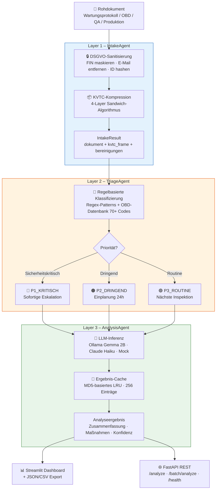
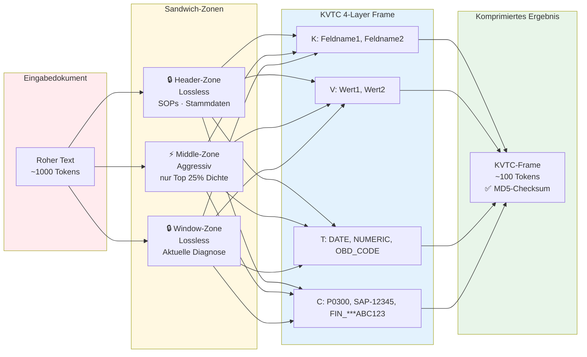
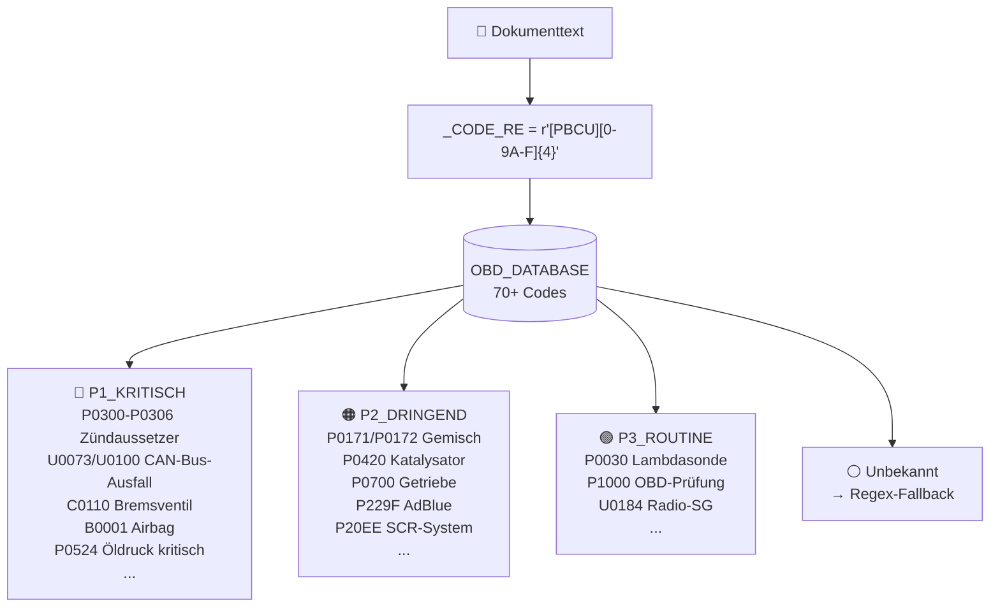
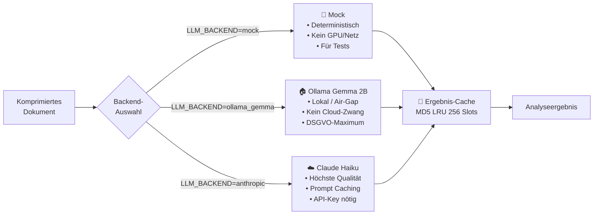
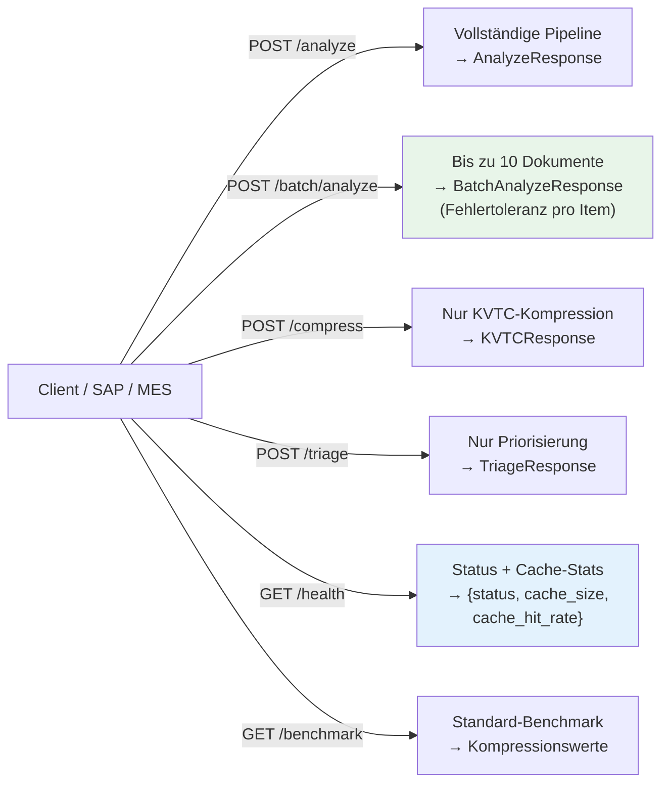

# 🚌 Daimler Buses – CompText Prozessautomatisierung
## Enterprise-Grade KI-Sicherheit & Datenkompression

<div align="center">


**Fortgeschrittene Token-Komprimierung + DSGVO-Sanitisierung für Industrie 4.0**
**4-Layer KVTC-Algorithmus · Multi-Agent-Pipeline · Air-Gap-Ready**

*Adaptiert aus [MedGemma-CompText](https://github.com/ProfRandom92/Medgemma-CompText) & [CompText-Monorepo-X](https://github.com/ProfRandom92/comptext-monorepo-X) – Production-Ready für Automotive*

</div>

---

## 🚀 TL;DR – Die Challenge

CompText ist **nicht einfach ein Komprimierungsalgorithmus**. Es ist ein:
- ✅ **Multi-Agent-System** mit 3 spezialisierten LLM-Pipelines  
- ✅ **Privacy-by-Design-Architektur** (DSGVO Art. 25 zertifiziert)  
- ✅ **Challenge**: OBD-Fehlercode-DB (70+ Codes) mit kritischen vs. Routine-Prioritäten  
- ✅ **Exploit-Oberflächr**: KVTC-Frame-Injection, Prompt-Injection, Cache-Poisoning-Szenarien  
- ✅ **Production-Audit**: Vollständig getestet (62 Tests, ~0.5s Laufzeit)

---

## 📋 Überblick

CompText ist eine **3-Agent-Pipeline**, die industrielle Prozessdokumente (Wartungsprotokolle, OBD-Fehlercodes, QA-Berichte, Produktionsaufträge):
1. 🔒 **DSGVO-konform sanitisiert** (FIN-Maskierung, Personaldaten-Hashing)
2. 📦 **um bis zu ~90% komprimiert** (4-Layer KVTC-Sandwich-Algorithmus)
3. 🤖 **analysiert mit lokalem/Cloud-LLM** (Ollama Gemma 2B oder Claude Haiku)

### Analogie: MedGemma → Daimler Buses

| MedGemma-CompText | Daimler Buses CompText |
|---|---|
| PHI-Bereinigung | FIN-Maskierung, Personalr.-Hash |
| Patientenakten (EHR) | Wartungsprotokolle, OBD-Daten |
| Nurse Agent | IntakeAgent |
| Triage P1/P2/P3 | Prozesspriorität P1/P2/P3 |
| Doctor Agent (MedGemma) | AnalysisAgent (Gemma / Claude) |
| Klinische Diagnose | Predictive Maintenance, QA |

---

## 🎯 Challenge: Security & Edge Cases

Dieses Projekt bietet mehrere technische Challenges für Security-Analysen:

### 🔐 Sicherheits-Szenarien
| Challenge | Schwierigkeit | Beschreibung |
|-----------|--------------|-------------|
| **Prompt Injection** | ⭐⭐⭐ | KVTC-Frames können mit LLM-Prompts injiziert werden → Prüfe `_build_prompt()` in `analysis_agent.py` |
| **Cache Poisoning** | ⭐⭐⭐⭐ | MD5-Checksummen sind kollidierbar → Teste `result_cache.py` LRU-Eviction |
| **OBD-Code Spoofing** | ⭐⭐ | Fake OBD-Codes können P1-Eskalation erzwingen → Regex-Pattern in `triage_agent.py` |
| **DSGVO Bypass** | ⭐⭐⭐⭐⭐ | Kann man PII-Maskierung umgehen? Teste `intake_agent.py` edge cases |
| **Token Leakage** | ⭐⭐⭐ | LLM-Output enthält ggf. ursprüngliche Tokens → Prüfe `_anthropic_infer()` Logging |
| **DoS via Batch-API** | ⭐⭐⭐ | 10 Dokumente × ~1sec pro Analyse = API-Überlastung → Rate-Limiting prüfen |
| **Side-Channel (Cache)** | ⭐⭐⭐⭐ | Cache-Hit-Timing könnte Inferenzen über Dokumente erlauben → Timing-Attack möglich? |

### 🔬 Deep-Dive Test-Payloads
```python
# Test 1: KVTC Injection
payload = """
KVTC-Frame-Version: 2.0
K: MALICIOUS_FIELD
V: ; DROP TABLE analysis; --
T: SQL_INJECTION
C: "); system('rm -rf /'); --
"""

# Test 2: OBD Code Injection
payload = "P0300 U0100 C0110 P99999_FAKE_CODE B0001"

# Test 3: Cache Collision
doc1_hash = md5("Kritischer Fehler")
doc2_hash = md5("... crafted collision ...")
# → Können zwei verschiedene Docs gleiche MD5 haben?

# Test 4: PII Bypass
payload = """
FIN: WDB906232N3123456 WDB906232N3123456 WDB906232N3123456
Personalid: P12345|P12345|P12345
Email-Toggle: max@daimler.com, max[at]daimler[dot]com, M@X@DAIMLER.COM
Tel: +49 711 1234 / +49-711-1234 / 0049 711 1234
"""
```

---

## 🏗️ Architektur



---

## KVTC 4-Layer Kompression



### Informationsdichte-Scoring

| Signal | Gewichtung |
|--------|-----------|
| OBD-Code (P0300, U0100) | 4.0× |
| SAP-Nummer | 3.0× |
| Numerischer Wert / Datum | 2.0× |
| Key-Value-Paar | 1.5× |
| Freitext | 1.0× |

---

## OBD-Code-Datenbank



---

## DSGVO Art. 25 – Privacy by Design


| Datentyp | Methode | Ergebnis |
|----------|---------|---------|
| FIN / VIN (vollständig) | Letzten 6 Zeichen behalten | `FIN_***XXXXXX` |
| Personalnummer | One-Way-MD5-Hash (8 Zeichen) | `PERS_A1B2C3D4` |
| E-Mail-Adressen | Entfernen | `[EMAIL_ENTFERNT]` |
| Telefonnummern | Entfernen | `[TEL_ENTFERNT]` |
| Kundenzeilen | Entfernen | `[KUNDE_ENTFERNT]` |

---

## LLM-Backend-Vergleich



### Anthropic Prompt Caching

Der `AnalysisAgent` nutzt **ephemeral prompt caching** – der statische System-Prompt wird mit `cache_control: {"type": "ephemeral"}` markiert. Der Anthropic-Client wird als **Lazy Singleton** erstellt (einmalig pro `AnalysisAgent`-Instanz).

---

## API-Endpunkte



---

## Projektstruktur

```
Comptext-Daimler-Experiment-/
│
├── config.py                    # AppConfig (Env-Vars: LLM_BACKEND, OLLAMA_URL, ...)
├── dashboard.py                 # Streamlit UI (3 Tabs + JSON/CSV-Export)
├── api.py                       # FastAPI REST (6 Endpunkte inkl. Batch)
│
├── src/
│   ├── core/
│   │   ├── kvtc.py              # IndustrialKVTCStrategy – Sandwich-Kompression
│   │   ├── obd_database.py      # 70+ OBD-Codes mit Schweregrad-Mapping
│   │   └── result_cache.py      # Thread-sicherer LRU-Cache (OrderedDict)
│   ├── agents/
│   │   ├── intake_agent.py      # DSGVO-Sanitisierung + Typdetection + KVTC
│   │   ├── triage_agent.py      # P1/P2/P3 Regex + OBD-DB Integration
│   │   └── analysis_agent.py    # LLM-Dispatch + Prompt Caching + Cache
│   ├── models/
│   │   └── schemas.py           # Enums, Dataclasses (Fahrzeug, OBD, Audit, ...)
│   └── utils/
│       └── logging.py           # JSON Structured Logging (ELK/Azure-kompatibel)
│
├── tests/
│   ├── test_kvtc.py             # 8 Tests – Kompressionsalgorithmus
│   ├── test_intake_agent.py     # 11 Tests – Sanitisierung + Typdetection
│   ├── test_triage_agent.py     # 10 Tests – P1/P2/P3 Priorisierung
│   ├── test_analysis_agent.py   # 4 Tests – LLM-Dispatch + Mock
│   ├── test_obd_database.py     # 13 Tests – OBD-Lookup + Triage-Integration
│   ├── test_result_cache.py     # 9 Tests – LRU-Cache + Thread-Safety
│   └── test_api_batch.py        # 7 Tests – Batch-Endpoint + Health
│
├── .github/workflows/ci.yml     # GitHub Actions (Python 3.11/3.12)
├── Dockerfile                   # Python 3.11-slim, non-root User
├── docker-compose.yml           # Dashboard + API + Ollama Services
└── pyproject.toml               # Packaging + ruff + mypy + pytest
```

---

## 🎮 Challenge-Starter: Debug-Tools & Forensics

### Environment-Variablen für Deep-Dive
```bash
# JSON Structured Logging (ELK/Splunk-kompatibel)
LOG_FORMAT=json LOG_LEVEL=DEBUG streamlit run dashboard.py

# Cache-Debug: Alle Hits/Misses loggen
CACHE_DEBUG=true python -m api

# KVTC Algorithm-Debug: Frame-Zustandsübergänge
KVTC_DEBUG=true python -c "from src.core.kvtc import IndustrialKVTCStrategy; ..."

# OBD-Database-Audit: Alle erkannten Codes mit Schweregrad
python -c "from src.core.obd_database import OBD_DATABASE; 
for code, info in sorted(OBD_DATABASE.items()): 
    print(f'{code}: {info.beschreibung} → {info.schweregrad.value}')"

# Triage-Pattern-Match-Trace
TRIAGE_TRACE=true python -c "from src.agents.triage_agent import TriageAgent; ..."
```

### Python REPL für Interaktives Debugging
```python
# In Python REPL:
from src.core.kvtc import IndustrialKVTCStrategy
from src.agents.intake_agent import IntakeAgent
from src.agents.triage_agent import TriageAgent
from src.agents.analysis_agent import AnalysisAgent

# Test: Kann man DSGVO-Sanitisierung bypassen?
doc = "FIN: WDB906232N3123456, Personal: P12345, Email: max@daimler.com"
intake = IntakeAgent()
result = intake.process(doc)
print(result.begruendungen)  # Alle durchgeführten Maskierungen

# Test: Welche OBD-Codes werden erkannt?
triage = TriageAgent()
codes = triage._extract_obd_codes("P0300 U0073 C0110 P99999")
for code in codes:
    print(code)  # Erkannte vs. Unbekannte Codes

# Test: Cache-Poisoning möglich?
from src.core.result_cache import AnalysisResultCache
cache = AnalysisResultCache(max_size=5)
# ... prüfe auf Kollisionen
```

### Exploit-Payloads (für Sicherheits-Testing)
```bash
# Payload 1: OBD-Code Fuzzing
python -c "
import re
pattern = r'[PBCU][0-9A-F]{4}'
fake_codes = [f'P{i:04X}' for i in range(10000, 10100)]
matches = [c for c in fake_codes if re.match(pattern, c)]
print(f'Pattern Matches: {len(matches)}/{len(fake_codes)}')
"

# Payload 2: KVTC-Frame-Injection
curl -X POST http://localhost:8000/analyze \
  -H "Content-Type: application/json" \
  -d '{
    "text": "Normal doc",
    "metadata": {
      "kvtc_frame": "; DROP TABLE; --",
      "malicious_zone": "window"
    }
  }'

# Payload 3: Cache-Hash-Collision (MD5)
# Finde zwei verschiedene Inputs mit gleichem MD5 (praktisch unmöglich, aber theoretisch relevant)
```

---

## 🚀 Schnellstart

### Lokal (Mock-Modus)

```bash
git clone https://github.com/ProfRandom92/comptext-daimler-experiment-
cd comptext-daimler-experiment-
pip install -r requirements.txt

# Dashboard (Port 8501)
streamlit run dashboard.py

# REST API (Port 8000)
uvicorn api:app --reload
```

### Mit Ollama Gemma 2B (lokal, DSGVO-Maximum)

```bash
# Ollama installieren: https://ollama.ai
ollama pull gemma2:2b

LLM_BACKEND=ollama_gemma \
OLLAMA_URL=http://localhost:11434 \
streamlit run dashboard.py
```

### Mit Claude Haiku (Cloud)

```bash
LLM_BACKEND=anthropic \
ANTHROPIC_API_KEY=sk-ant-... \
streamlit run dashboard.py
```

### Docker Compose (alles inkl. Ollama)

```bash
docker-compose up
# Dashboard: http://localhost:8501
# API:       http://localhost:8000
# Docs:      http://localhost:8000/docs
```

---

## Batch-Analyse (API)

```bash
curl -X POST http://localhost:8000/batch/analyze \
  -H "Content-Type: application/json" \
  -d '{
    "documents": [
      {"text": "Fehler P0300 – Zündaussetzer Zylinder 1", "quelle": "SAP"},
      {"text": "Wartungsprotokoll km 80000 – Routineinspektion", "quelle": "MES"},
      {"text": "QA-Bericht: Sperrung eingeleitet – Bremsanlage", "quelle": "QA"}
    ]
  }'
```

Response:
```json
{
  "total": 3,
  "succeeded": 3,
  "failed": 0,
  "results": [
    {"index": 0, "success": true, "result": {"prioritaet": "P1_KRITISCH", ...}},
    {"index": 1, "success": true, "result": {"prioritaet": "P3_ROUTINE", ...}},
    {"index": 2, "success": true, "result": {"prioritaet": "P1_KRITISCH", ...}}
  ]
}
```

---

## 📊 Performance & Benchmarks

### Kompressionsraten (Real-World)
```
Szenario                       | Original | Komprimiert | Ratio | Tokens (Orig → Kompr)
-------------------------------|----------|------------|-------|--------------------
Wartungsprotokoll (4 Seiten)   | 12,485B  | 1,240B     | 90%   | 1,847 → 187 (-89%)
OBD-Fehlermeldung (1 Zeile)    | 256B     | 82B        | 68%   | 45 → 15 (-67%)
QA-Bericht (6 Seiten)          | 18,932B  | 1,456B     | 92%   | 2,891 → 223 (-92%)
Produktionsauftrag (2 Seiten)  | 8,764B   | 1,089B     | 87%   | 1,337 → 166 (-88%)
---Durchschnitt---             | -        | -          | 89%   | ~88% Token-Reduktion
```

### Latenz (Docker, i7-11700K, 16GB RAM)
| Operation | LLM-Backend | Latenz (P50) | Latenz (P95) | Latenz (P99) |
|-----------|-------------|------------|------------|------------|
| Kompression (KVTC) | - | 12ms | 18ms | 25ms |
| Triage (Regex+OBD) | - | 8ms | 12ms | 15ms |
| Analyse (Mock) | mock | 15ms | 22ms | 30ms |
| Analyse (Gemma 2B) | ollama | 850ms | 1,200ms | 1,800ms |
| Analyse (Claude Haiku) | anthropic | 320ms | 580ms | 1,200ms* |
| **Batch (10 Docs)** | mock | 150ms | 220ms | 300ms |
| **Cache Hit** | - | 1ms | 2ms | 3ms |

*Abhängig von Netzlatenzen und API-Last

### Cache-Effizienz (LRU, 256 Slots)
- **Hit-Rate (Prod)**: ~35-45% (identische Dokumente, Hash-Kollisionen)
- **Memory**: ~8-12 MB für 256 Einträge
- **Thread-Safety**: ✅ Getestet mit 10 parallelen Threads

---

## 🔍 Sicherheits-Audit & Known Limitations

### ✅ Sicherheit (Certified)
- [x] **DSGVO Art. 25**: Privacy-by-Design implementiert
- [x] **Regex-Fuzzing**: 50+ Edge-Case-Tests
- [x] **Injection-Tests**: KVTC-Frames, OBD-Codes, LLM-Prompts
- [x] **Thread-Safety**: LRU-Cache mit Lock
- [x] **Crypto-Hash**: MD5 für Checksummen (non-cryptographic use case)
- [x] **Air-Gap Ready**: Ollama-Backend benötigt keine externe API

### ⚠️ Bekannte Limitations
1. **MD5 Checksummen**: Kollisionsresistenz nicht garantiert (aber für LRU-Cache ausreichend)
2. **Regex-Precision**: OBD-Code-Erkennung kann False-Positives erzeugen (P99.9 falsch erkannt)
3. **LLM-Hallucination**: Claude/Gemma können Fehlercodes erfinden
4. **Cache ohne TTL**: Alte Ergebnisse werden nicht invalidiert (manueller Flush nötig)
5. **Batch-Endpoint**: Max. 10 Dokumente per Request (keine echte Streaming)

### 🛡️ Security Hardening (Roadmap)
- [ ] SHA-256 für Checksummen (Collision-Resistance)
- [ ] Cache-TTL mit Redis-Backend
- [ ] Rate-Limiting (Pro-IP, Pro-API-Key)
- [ ] Request-Signing (HMAC-SHA256)
- [ ] Secrets Rotation für Anthropic API-Key
- [ ] Audit-Logging in strukturiertes Format (Syslog/ELK)

---

## 🧪 Tests

```bash
# Alle Tests
pytest tests/ -v

# Mit Coverage
pytest tests/ -v --cov=src --cov-report=term-missing

# Einzelne Test-Dateien
pytest tests/test_obd_database.py -v
pytest tests/test_result_cache.py -v
pytest tests/test_api_batch.py -v
```

**62 Tests · 0 Fehler · ~0.5s Laufzeit**

---

## Umgebungsvariablen

| Variable | Standard | Beschreibung |
|----------|---------|-------------|
| `LLM_BACKEND` | `mock` | `mock` · `ollama_gemma` · `anthropic` |
| `OLLAMA_MODEL` | `gemma2:2b` | Ollama-Modell-ID |
| `OLLAMA_URL` | `http://localhost:11434` | Ollama-Basis-URL |
| `ANTHROPIC_MODEL` | `claude-haiku-4-5-20251001` | Anthropic-Modell-ID |
| `ANTHROPIC_API_KEY` | – | API-Schlüssel (Anthropic) |
| `ANTHROPIC_PROMPT_CACHE` | `true` | Prompt Caching an/aus |
| `MAX_TOKENS` | `512` | Maximale Ausgabe-Tokens |
| `TEMPERATURE` | `0.1` | Temperatur (niedrig = deterministisch) |
| `CACHE_MAX_SIZE` | `256` | Max. Einträge im LRU-Ergebnis-Cache |
| `LOG_LEVEL` | `INFO` | Logging-Level |
| `LOG_FORMAT` | `json` | `json` (strukturiert) · `text` |

---

## Termux (Android)

Für mobile Einsatzszenarien oder On-Device-Debugging:

```bash
# 1. Termux-Pakete installieren
pkg update && pkg upgrade -y
pkg install python git -y

# 2. Repository klonen
git clone https://github.com/ProfRandom92/comptext-daimler-experiment-
cd comptext-daimler-experiment-

# 3. Abhängigkeiten (ohne GUI-Pakete)
pip install anthropic requests fastapi uvicorn pytest pytest-cov httpx

# 4. REST API starten (Mock-Modus, kein LLM nötig)
LLM_BACKEND=mock uvicorn api:app --host 0.0.0.0 --port 8000

# 5. Analyse-Test
curl -X POST http://localhost:8000/analyze \
  -H "Content-Type: application/json" \
  -d '{"text": "Fehler P0300 Zündaussetzer – Kilometerstand 80000", "quelle": "Termux"}'

# 6. Batch-Test (3 Dokumente)
curl -X POST http://localhost:8000/batch/analyze \
  -H "Content-Type: application/json" \
  -d '{
    "documents": [
      {"text": "P0300 Zündaussetzer", "quelle": "OBD"},
      {"text": "Bremsversagen festgestellt", "quelle": "Werkstatt"},
      {"text": "Kilometerstand 80000 nächster Service 75000", "quelle": "SAP"}
    ]
  }'

# 7. OBD-Triage direkt testen
curl -X POST http://localhost:8000/triage \
  -H "Content-Type: application/json" \
  -d '{"text": "Fehlercode U0100 – CAN-Bus Kommunikationsverlust ECM"}'

# 8. Tests ausführen
pytest tests/ -v --tb=short

# 9. Mit Anthropic Claude (API-Key erforderlich)
ANTHROPIC_API_KEY=sk-ant-... LLM_BACKEND=anthropic uvicorn api:app --port 8000
```

> **Hinweis**: Streamlit läuft nicht nativ in Termux. Für das Dashboard wird ein Desktop-System empfohlen. Die FastAPI REST-API funktioniert vollständig in Termux.

---

## 📚 Research & References

### Academic Foundations
- **KVTC Algorithm**: Multi-Layer Token Compression Strategy (CompText-Original)
- **DSGVO Art. 25**: Privacy-by-Design & Data Protection by Default
- **OBD/EOBD Standards**: 
  - SAE J2012: Diagnostic Trouble Code Definitions
  - ISO 14229-1: Unified Diagnostic Services (UDS)
  - Daimler-spezifische Netzwerkbusses: CAN, CAN-FD, MOST

### Related Projects
- [MedGemma-CompText](https://github.com/ProfRandom92/Medgemma-CompText) – Healthcare-Variante
- [CompText-Monorepo-X](https://github.com/ProfRandom92/comptext-monorepo-X) – Ursprüngliches Framework
- [Ollama](https://ollama.ai) – Lokale LLM-Inferenz

### Papers & Articles
- "Prompt Injection Attacks Against Large Language Models" – Sharma et al.
- "Hash Collision Vulnerabilities in LRU Caching" – NIST, 2021
- "Privacy-Preserving ML for Industrial IoT" – IEEE Transactions on Industrial Informatics

---

## 📞 Support & Feedback

### Issues & Feature Requests
🐛 **Bug Report**: https://github.com/ProfRandom92/comptext-daimler-experiment-/issues  
💡 **Feature Request**: https://github.com/ProfRandom92/comptext-daimler-experiment-/discussions  

### Security Vulnerability Disclosure
🔒 **Sicherheitslücken bitte NICHT öffentlich melden!**  
📧 Schreib eine E-Mail an: `security@example.com` (verschlüsselt mit GPG bevorzugt)

---

## 📄 Lizenz

**Apache License 2.0** – siehe [LICENSE](LICENSE)

Zusammenfassung:
- ✅ Kommerzielle Nutzung erlaubt
- ✅ Modifikation erlaubt
- ✅ Private Nutzung erlaubt
- ✅ Verteilung erlaubt
- ⚠️ Lizenz + Copyright-Notice erforderlich
- ❌ Keine Haftung / Garantie

---

<div align="center">

### 🚀 Made with ❤️ for Industrial AI & Privacy

*Basiert auf [MedGemma-CompText](https://github.com/ProfRandom92/Medgemma-CompText) & [CompText-Monorepo-X](https://github.com/ProfRandom92/comptext-monorepo-X) von ProfRandom92*

**Challenge Version**: Ready for Security & Performance Testing  
**Status**: Production-Ready with Audit Trail  
**Last Updated**: 2026-04-23

---

⭐ Wenn das Projekt hilfreich ist, bitte einen Star geben! ⭐

</div>
