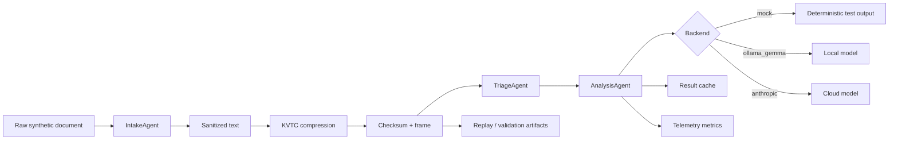

# CompText Daimler Experiment

<div align="center">


**Semantic compression + replay-aware AI infrastructure research.**

A compact systems-engineering showcase for token reduction, semantic retention,
structured triage, synthetic benchmarking, and privacy-aware AI inference flows.

</div>

---

## Why this exists

Modern AI systems are increasingly constrained by context cost, latency, and auditability rather than raw model access. Enterprise workflows often send verbose logs, diagnostics, shift notes, or process records into LLMs even when the model only needs a small amount of structured signal.

CompText explores a pre-inference optimization layer that transforms noisy industrial-style text into compact, typed, replayable frames before analysis. The goal is not to claim universal compression. The goal is to make token reduction measurable, inspectable, and safe enough to review.

**Research framing:** semantic compression + replay-aware AI infrastructure.

**Practical framing:** reduce irrelevant tokens, preserve operational meaning, validate the transformation, and keep enough metadata to reproduce decisions.

---

## System at a glance

| Layer | Responsibility | Review signal |
|---|---|---|
| Intake | sanitize input, mask sensitive identifiers, build a KVTC frame | privacy boundary before model calls |
| Compression | split documents into zones and extract key/value/type/code structure | token reduction with checksums |
| Triage | classify priority with deterministic rules and an OBD code database | explainable pre-LLM routing |
| Analysis | call mock, local Ollama, or Anthropic backend through a common agent | swappable inference path |
| Cache | reuse analysis results keyed by compressed-frame checksum | lower repeated inference cost |
| Telemetry | emit aggregate token, latency, and scenario metrics only | observability without raw payloads |
| Benchmarks | generate synthetic reports and machine-readable summaries | reproducible regression evidence |



---

## Core concept: KVTC semantic compression

KVTC means **Key · Value · Type · Code**. The compressor estimates token volume, separates the document into zones, extracts structured fields, and serializes a compact frame.

| Component | What it preserves | Why it matters |
|---|---|---|
| `K` | field names and labels | keeps business/diagnostic context |
| `V` | selected values | keeps decision-relevant facts |
| `T` | inferred types such as date, numeric, enum, OBD code | enables validation and replay checks |
| `C` | structured identifiers such as OBD, SAP-like numbers, FIN fragments | preserves high-signal operational codes |

The strategy is intentionally transparent: generated frames include checksums, token estimates, latency, and zone metadata so reviewers can inspect what was retained and what was discarded.

---

## Semantic retention, replay, and validation

Token reduction is only useful when the retained representation can still support the downstream decision. This repository treats compression as an auditable transformation rather than a magic summarizer.

**Retention controls**

- lossless header/window zones for context and current diagnostic state;
- aggressive middle-zone filtering for older or lower-density lines;
- typed extraction for operational fields and diagnostic codes;
- deterministic triage before generative analysis.

**Replay controls**

- every compressed frame is hashed with SHA-256;
- benchmark summaries are written as Markdown and JSON artifacts;
- report-contract validation checks whether generated summaries keep the expected shape;
- synthetic-only fixtures make reproduction possible without production data.

**Known limitation:** semantic retention is workload-dependent. The current implementation is a research prototype and should be validated on task-specific gold sets before production use.

---

## Repository map

```text
.
├── api.py                         # FastAPI surface for compression, triage, analysis, benchmarks
├── render_app.py                  # Render/static showcase entrypoint
├── src/
│   ├── agents/                    # intake, triage, analysis agents
│   ├── core/                      # KVTC strategies, cache, OBD database
│   ├── models/                    # Pydantic/domain schemas
│   └── telemetry.py               # aggregate metrics exporter
├── tests/                         # unit and API behavior tests
├── scripts/                       # benchmark, sanitization, regression, smoke-check tooling
├── docs/
│   ├── ARCHITECTURE.md            # architecture and data-flow details
│   ├── BENCHMARK_METHODOLOGY.md   # benchmark design and interpretation
│   ├── BENCHMARK_WORKFLOW.md      # runnable report workflow
│   ├── FORENSIC_REPLAY.md         # replay-oriented validation notes
│   └── reports/                   # generated synthetic report artifacts
├── showcase/                      # React/Vite visual showcase
└── archive/                       # historical reports and one-off generated artifacts
```

---

## Quickstart

### 1. Create an environment

```bash
python -m venv .venv
source .venv/bin/activate
pip install -r requirements.txt
pip install -e .
```

### 2. Run the API in deterministic mode

```bash
LLM_BACKEND=mock uvicorn api:app --reload --port 8000
```

### 3. Compress a synthetic diagnostic note

```bash
curl -s http://localhost:8000/compress \
  -H 'Content-Type: application/json' \
  -d '{"text":"Fahrzeug: FIN WDB906232N3123456\nKilometerstand: 124000\nFehlercode: P0300\nBefund: Motorwarnleuchte aktiv"}' | python -m json.tool
```

### 4. Run the full analysis path

```bash
curl -s http://localhost:8000/analyze \
  -H 'Content-Type: application/json' \
  -d '{"quelle":"synthetic-demo","text":"OBD Meldung P0300. Motorwarnleuchte aktiv. Keine Kundendaten verwenden."}' | python -m json.tool
```

### 5. Run tests and benchmark checks

```bash
pytest tests/ --tb=short -q
python -m py_compile scripts/run_benchmarks.py scripts/generate_regression_report.py scripts/sanitize_fixtures.py scripts/validate_report_contracts.py
python scripts/run_benchmarks.py
python scripts/generate_regression_report.py
python scripts/sanitize_fixtures.py
python scripts/validate_report_contracts.py
```

---

## API surface

| Endpoint | Purpose |
|---|---|
| `GET /health` | runtime health and version check |
| `GET /stats` | process uptime and aggregate compression counters |
| `POST /compress` | KVTC compression only |
| `POST /compress/v7` | alternate KVTC v7 strategy path |
| `POST /triage` | deterministic priority classification |
| `POST /analyze` | intake → compression → triage → analysis |
| `POST /batch/analyze` | bounded batch analysis for synthetic documents |
| `GET /benchmark` | in-process sample benchmark |
| `GET /benchmark/v7` | v7 sample benchmark |
| `GET /benchmark/compare` | side-by-side strategy comparison |
| `POST /v1/optimize/xentry` | showcase diagnostic-log optimization contract |
| `POST /v1/filter/mo360` | showcase shift-report filtering contract |
| `POST /v1/dedup/supply-chain` | showcase deduplication contract |

---

## Benchmarking and artifacts

The benchmark workflow is designed for reproducibility and safety, not headline numbers.

| Artifact | Location | Use |
|---|---|---|
| Timestamped benchmark report | `docs/reports/benchmark-report-*.md` | human-readable run evidence |
| Latest benchmark summary | `docs/reports/benchmark-summary.json` | machine-readable CI/regression input |
| Regression summary | `docs/reports/regression-summary.md` / `.json` | compare recent synthetic runs |
| Sanitization summary | `docs/reports/sanitization-summary.json` | verify report content remains synthetic-safe |
| Contract validation report | `docs/reports/report-contract-validation-report.md` | validate report schema expectations |

Metric interpretation guidance lives in [`docs/BENCHMARK_METHODOLOGY.md`](docs/BENCHMARK_METHODOLOGY.md). The runnable workflow lives in [`docs/BENCHMARK_WORKFLOW.md`](docs/BENCHMARK_WORKFLOW.md).

---

## Observability

Telemetry is intentionally narrow. The tracker emits aggregate metrics such as endpoint name, original tokens, compressed tokens, savings percentage, latency, document type, scenario, and priority. It does not forward raw text.

Supported observability hooks:

- Tinybird Events API via `TINYBIRD_TOKEN`;
- optional OpenTelemetry initialization via `OTEL_EXPORTER_OTLP_ENDPOINT`;
- structured logs through the project logging utilities;
- CI-uploaded benchmark artifacts for reviewer inspection.

---

## CI and reproducibility

GitHub Actions currently cover three reviewer-critical paths:

| Workflow | Trigger | What it checks |
|---|---|---|
| `CI` | push / pull request | Python lint, tests, coverage, React build, Render entrypoint, Docker build |
| `Benchmark Checks` | pull request / manual | benchmark script syntax, report generation, sanitizer, contract validation |
| `Demo Live Smoke` | scheduled / manual | public demo health and smoke checks |

The default local equivalent is:

```bash
make audit
cd showcase && npm ci && npm run build
python scripts/validate_report_contracts.py
```

---

## Screenshots and diagrams

Place reviewer-facing visuals under `docs/assets/`.

| Placeholder | Intended content |
|---|---|
| `docs/assets/screenshots/api-docs.png` | FastAPI `/docs` view |
| `docs/assets/screenshots/showcase-home.png` | React showcase overview |
| `docs/assets/diagrams/architecture.png` | exported architecture diagram for non-Mermaid renderers |

Only synthetic payloads should appear in screenshots.

---

## Enterprise and research readiness

This repository is suitable for technical review because it emphasizes:

- deterministic preprocessing before LLM calls;
- explicit compression artifacts instead of opaque summaries;
- bounded batch behavior and API contracts;
- synthetic benchmark generation and validation;
- privacy-aware telemetry boundaries;
- clear limitations and archived historical noise.

It is **not** presented as production-certified software. Production hardening would require security review, load testing against representative workloads, documented data-processing agreements, model governance, and task-specific retention evaluation.

---

## Failure modes and limitations

| Area | Limitation | Mitigation path |
|---|---|---|
| Semantic loss | aggressive compression can drop relevant context | build labeled retention tests per workflow |
| Token estimation | character-based token estimates are approximate | compare with target model tokenizer in benchmarks |
| Synthetic data | current reports avoid production data by design | add approved anonymized gold sets if governance allows |
| Rule triage | deterministic patterns can miss novel cases | add confusion-matrix evaluation and review queues |
| External backends | Ollama/Anthropic paths depend on local services or keys | keep mock backend as deterministic baseline |
| Telemetry | aggregate metrics do not prove business value | connect metrics to task-specific acceptance criteria |

---

## Roadmap

- [ ] Add gold-set semantic retention tests with expected code/field preservation.
- [ ] Add tokenizer-specific benchmark adapters for selected model families.
- [ ] Expand replay reports with frame diffs and triage-decision snapshots.
- [ ] Add screenshots and exported architecture diagrams under `docs/assets/`.
- [ ] Separate research fixtures from runtime examples with stricter naming conventions.
- [ ] Add threat-model documentation for prompt injection, cache poisoning, and telemetry leakage.

---

## License

Apache-2.0. See [`LICENSE`](LICENSE).
