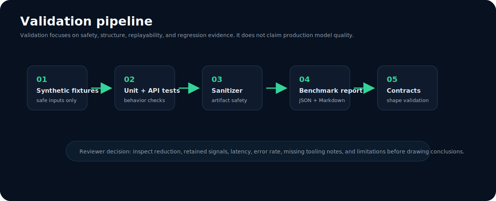

# CompText Daimler Experiment

<div align="center">


**Semantic compression and replay-aware inference infrastructure.**

A systems-engineering showcase for deterministic text compression, typed signal retention, replayable checksums, synthetic benchmarks, and safe validation artifacts.

</div>

---


## What this repository demonstrates

CompText explores a pre-inference optimization boundary for verbose industrial-style text. It sanitizes synthetic operational documents, extracts high-signal **Key · Value · Type · Code** structure, produces checksum-linked frames, routes priority with deterministic triage, and records benchmark artifacts that reviewers can reproduce.

The project is intentionally framed as **semantic compression and replay-aware inference infrastructure**. It is not presented as a universal token-reduction claim or a production performance benchmark.

## 30-second system map

| Layer | Responsibility | Review signal |
|---|---|---|
| Intake | Sanitize input, mask sensitive identifiers, invoke KVTC compression. | Privacy boundary before model calls. |
| Compression | Split zones and extract key/value/type/code structure. | Token tradeoffs, checksums, and retained signals are inspectable. |
| Triage | Classify priority with deterministic rules and an OBD code map. | Explainable pre-LLM routing. |
| Analysis | Dispatch to mock, local Ollama, or cloud backend through one agent. | Inference backend is swappable. |
| Cache | Reuse analysis results keyed by compressed-frame checksum. | Replay and repeated requests avoid redundant work. |
| Telemetry | Emit aggregate token, latency, document type, scenario, and priority metrics. | Observability without raw payload forwarding. |
| Benchmarks | Generate synthetic Markdown/JSON summaries and validate contracts. | Reproducible evidence for review and CI. |

## Documentation

| Document | Purpose |
|---|---|
| [`docs/architecture.md`](docs/architecture.md) | Runtime architecture, KVTC boundary, replay chain, backend modes. |
| [`docs/validation.md`](docs/validation.md) | CI flow, validation layers, replay consistency, semantic-retention interpretation. |
| [`docs/benchmarks.md`](docs/benchmarks.md) | Benchmark methodology, before/after comparisons, current synthetic results, tradeoffs. |
| [`docs/BENCHMARK_WORKFLOW.md`](docs/BENCHMARK_WORKFLOW.md) | Runnable report-generation workflow. |
| [`docs/FORENSIC_REPLAY.md`](docs/FORENSIC_REPLAY.md) | Replay-oriented review notes. |
| [`docs/ENTERPRISE_READINESS.md`](docs/ENTERPRISE_READINESS.md) | Enterprise-facing readiness and governance notes. |

## Core concept: KVTC semantic compression


KVTC means **Key · Value · Type · Code**. The compressor estimates token volume, separates text into retention zones, extracts structured fields, serializes a compact frame, and generates a SHA-256 checksum for replay and cache lookup.

| Component | Preserves | Why it matters |
|---|---|---|
| `K` | field names and labels | Keeps business and diagnostic context. |
| `V` | selected values | Keeps decision-relevant facts. |
| `T` | inferred types such as date, numeric, enum, OBD code | Enables validation and replay checks. |
| `C` | structured identifiers such as OBD and SAP-like codes | Preserves high-signal operational references. |

## Benchmark clarity


The benchmark posture is conservative:

- all committed benchmark artifacts are synthetic;
- optional load metrics remain `null` when tooling such as Locust is unavailable;
- short inputs may expand because structured metadata has fixed overhead;
- compression ratio is interpreted alongside retained signals, replay consistency, latency, and error rate;
- limitations are documented rather than hidden.

See [`docs/benchmarks.md`](docs/benchmarks.md) for methodology, current synthetic tables, before/after framing, and known tradeoffs.

## Validation and replay



Replay-oriented review relies on explicit artifacts:

| Artifact | Location | Use |
|---|---|---|
| Timestamped benchmark report | `docs/reports/benchmark-report-*.md` | Human-readable run evidence. |
| Latest benchmark summary | `docs/reports/benchmark-summary.json` | Machine-readable CI/regression input. |
| Regression summary | `docs/reports/regression-summary.md` / `.json` | Compare recent synthetic runs. |
| Sanitization summary | `docs/reports/sanitization-summary.json` | Verify generated artifacts remain synthetic-safe. |
| Contract validation report | `docs/reports/report-contract-validation-report.md` | Validate report schema expectations. |

## Repository map

```text
.
├── api.py                         # FastAPI compression, triage, analysis, benchmark endpoints
├── render_app.py                  # Render/static showcase entrypoint
├── src/                           # agents, KVTC core, schemas, telemetry
├── tests/                         # unit and API behavior tests
├── scripts/                       # benchmark, regression, sanitization, contract checks
├── docs/                          # architecture, validation, benchmark, enterprise docs
├── docs/reports/                  # generated synthetic evidence artifacts
├── assets/diagrams/               # architecture and validation visuals
├── assets/screenshots/            # screenshot-style documentation assets
├── showcase/                      # React/Vite visual showcase
└── archive/                       # historical reports and one-off generated artifacts
```

## Quickstart

```bash
python -m venv .venv
source .venv/bin/activate
pip install -r requirements.txt
pip install -e .
LLM_BACKEND=mock uvicorn api:app --reload --port 8000
```

Compress a synthetic diagnostic note:

```bash
curl -s http://localhost:8000/compress \
  -H 'Content-Type: application/json' \
  -d '{"text":"Fahrzeug: FIN WDB906232N3123456\nKilometerstand: 124000\nFehlercode: P0300\nBefund: Motorwarnleuchte aktiv"}' | python -m json.tool
```

Run the full deterministic analysis path:

```bash
curl -s http://localhost:8000/analyze \
  -H 'Content-Type: application/json' \
  -d '{"quelle":"synthetic-demo","text":"OBD Meldung P0300. Motorwarnleuchte aktiv. Keine Kundendaten verwenden."}' | python -m json.tool
```

## API surface

| Endpoint | Purpose |
|---|---|
| `GET /health` | Runtime health and version check. |
| `GET /stats` | Process uptime and aggregate compression counters. |
| `POST /compress` | KVTC compression only. |
| `POST /compress/v7` | Alternate KVTC v7 strategy path. |
| `POST /triage` | Deterministic priority classification. |
| `POST /analyze` | Intake → compression → triage → analysis. |
| `POST /batch/analyze` | Bounded batch analysis for synthetic documents. |
| `GET /benchmark` | In-process sample benchmark. |
| `GET /benchmark/v7` | v7 sample benchmark. |
| `GET /benchmark/compare` | Side-by-side strategy comparison. |
| `POST /v1/optimize/xentry` | Showcase diagnostic-log optimization contract. |
| `POST /v1/filter/mo360` | Showcase shift-report filtering contract. |
| `POST /v1/dedup/supply-chain` | Showcase deduplication contract. |

## Local checks

```bash
pytest tests/ --tb=short -q
python -m py_compile scripts/run_benchmarks.py scripts/generate_regression_report.py scripts/sanitize_fixtures.py scripts/validate_report_contracts.py
python scripts/run_benchmarks.py
python scripts/generate_regression_report.py
python scripts/sanitize_fixtures.py
python scripts/validate_report_contracts.py
```

For the full CI-equivalent path, run:

```bash
make audit
cd showcase && npm ci && npm run build
python scripts/validate_report_contracts.py
```

## Honest limitations

- Synthetic fixtures are useful for repeatable review, but they do not prove production distribution coverage.
- Short documents can expand after KVTC framing because metadata has fixed overhead.
- Semantic retention needs task-specific expected-field tests before production use.
- Mock-mode analysis validates orchestration, not model quality.
- Optional load-test metrics require Locust and a reachable target service.
