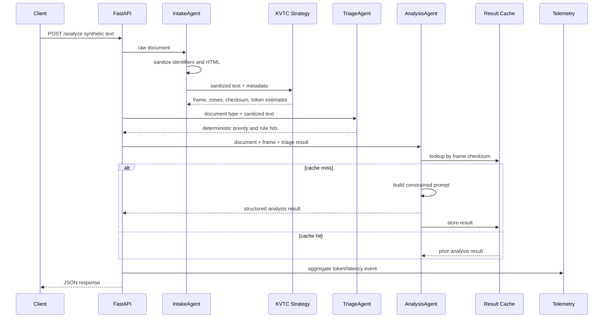
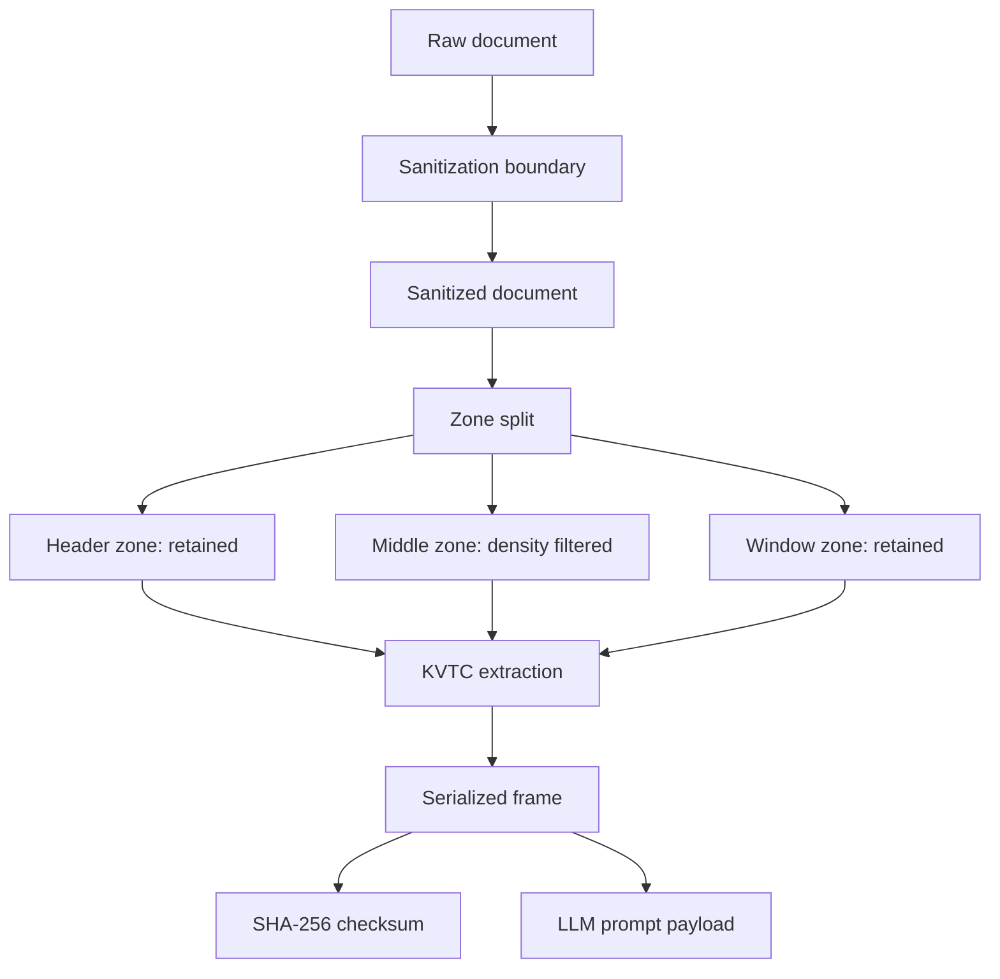

# Architecture

CompText is organized as a small AI systems pipeline: sanitize, compress, classify, analyze, cache, observe, and benchmark. The design goal is reviewer-grade inspectability rather than maximal abstraction.

## Runtime data flow

## Components

| Component | File | Responsibility |
|---|---|---|
| API application | `api.py` | HTTP contracts, request validation, endpoint orchestration, CORS |
| Intake agent | `src/agents/intake_agent.py` | sensitive-data masking, HTML sanitization, KVTC invocation |
| KVTC strategy | `src/core/kvtc.py` | zone splitting, typed extraction, frame serialization, checksum generation |
| KVTC v7 strategy | `src/core/kvtc_v7_strategy.py` | alternate strategy path used for comparison endpoints |
| Triage agent | `src/agents/triage_agent.py` | deterministic priority classification with rule hits and OBD lookup |
| OBD database | `src/core/obd_database.py` | curated synthetic code-to-priority mapping |
| Analysis agent | `src/agents/analysis_agent.py` | backend dispatch, prompt construction, structured output parsing |
| Result cache | `src/core/result_cache.py` | bounded LRU cache keyed by compressed-frame checksum |
| Telemetry | `src/telemetry.py` | aggregate-only metric events and optional OpenTelemetry setup |

## Compression boundary

The compression boundary is intentionally before any LLM call. This makes it possible to inspect the exact payload sent to a model backend, compare token estimates, and replay a decision from the checksum-linked frame.

## Backend modes

| Backend | Environment | Best use |
|---|---|---|
| `mock` | `LLM_BACKEND=mock` | deterministic tests, CI, local demos without keys |
| `ollama_gemma` | local Ollama service and model | offline/local inference experiments |
| `anthropic` | `ANTHROPIC_API_KEY` and configured model | cloud model quality experiments |

## Design constraints

- Keep preprocessing deterministic and testable.
- Keep benchmark fixtures synthetic-only.
- Never emit raw payloads through telemetry.
- Prefer explicit Markdown/JSON artifacts over implicit local state.
- Avoid production claims unless backed by reproducible evidence.

## Review checklist

1. Run tests and report validation.
2. Inspect a `/compress` response for frame shape, checksum, latency, and token estimates.
3. Inspect `/triage` rule hits for deterministic explainability.
4. Run benchmark scripts and review `docs/reports/` updates.
5. Verify that any new fixture or screenshot contains synthetic data only.
