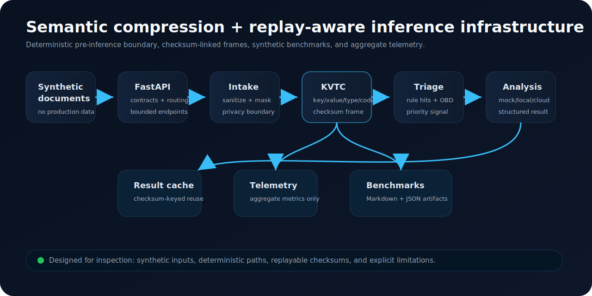
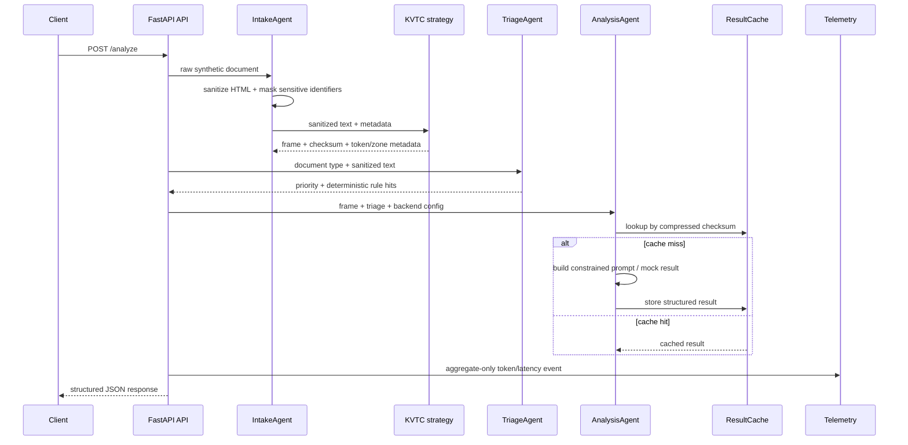
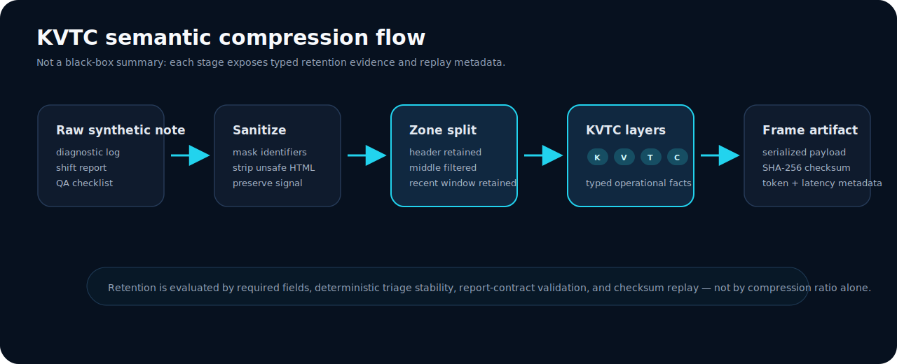
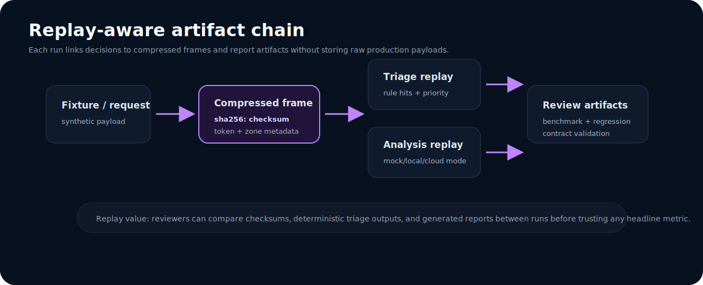

# Architecture

CompText is a compact AI infrastructure pipeline for **semantic compression and replay-aware inference**. It sits before model inference, converts verbose synthetic operational text into typed KVTC frames, and keeps enough metadata to inspect, cache, benchmark, and replay decisions.

## 30-second reviewer model

| Question | Answer |
|---|---|
| What is the system? | A pre-inference layer that sanitizes text, extracts key/value/type/code signals, triages priority, and calls a swappable analysis backend. |
| What makes it inspectable? | KVTC frames include token estimates, zones, checksums, latency, and metadata. |
| What is replay-aware? | The compressed frame checksum links a request to triage, analysis, cache, telemetry, and benchmark artifacts. |
| What is deliberately not claimed? | Universal compression, production Daimler performance, or model-quality guarantees. |

## Runtime flow

## Component map

| Layer | Primary files | Responsibility | Reviewer signal |
|---|---|---|---|
| API | `api.py` | Endpoint contracts, CORS, orchestration, validation errors | HTTP surface is explicit and bounded. |
| Intake | `src/agents/intake_agent.py` | Sanitization and masking before compression | Privacy boundary precedes inference. |
| Compression | `src/core/kvtc.py`, `src/core/kvtc_v7_strategy.py` | KVTC extraction, zone retention, checksums, token estimates | Transformation is deterministic and inspectable. |
| Triage | `src/agents/triage_agent.py`, `src/core/obd_database.py` | Deterministic priority and diagnostic-code rules | Routing is explainable without an LLM. |
| Analysis | `src/agents/analysis_agent.py` | Mock/local/cloud backend dispatch and structured output handling | Backend can be swapped without changing the pipeline contract. |
| Cache | `src/core/result_cache.py` | Bounded checksum-keyed reuse | Replay and repeat requests avoid unnecessary analysis calls. |
| Telemetry | `src/telemetry.py` | Aggregate metrics and optional external export | Observability avoids raw payload leakage. |
| Reports | `scripts/*.py`, `docs/reports/` | Benchmarks, sanitization, regression, report contracts | Evidence is reproducible and reviewable. |

## Semantic compression boundary

KVTC stands for **Key · Value · Type · Code**. The current strategy preserves high-signal fields and structured identifiers while filtering low-density middle content. The output is a compact frame, not a natural-language summary.

| KVTC layer | Examples | Purpose |
|---|---|---|
| `K` | field labels, operational keys | Preserve context and field semantics. |
| `V` | selected values | Preserve decision-relevant facts. |
| `T` | date, numeric, enum, OBD code, text | Make retained values easier to validate. |
| `C` | diagnostic codes, SAP-like identifiers, FIN fragments | Preserve high-signal operational identifiers. |

## Replay and evidence chain

Replay is based on stable artifacts rather than hidden state:

1. Synthetic input is sanitized and compressed.
2. The serialized frame receives a SHA-256 checksum.
3. Triage and analysis consume the frame and deterministic metadata.
4. Cache lookups use the checksum.
5. Benchmark and validation reports record machine-readable summaries.
6. Reviewers compare checksums, report contracts, and regression summaries between runs.

## Backend modes

| Backend | Configuration | Intended use |
|---|---|---|
| `mock` | `LLM_BACKEND=mock` | CI, deterministic tests, reviewer demos without credentials. |
| `ollama_gemma` | Local Ollama service | Local inference experiments. |
| `anthropic` | API key and model config | Cloud model experiments when explicitly configured. |

## Design constraints

- Keep the pre-inference path deterministic and testable.
- Keep telemetry aggregate-only and avoid raw payload export.
- Use synthetic fixtures for benchmarks and committed artifacts.
- Treat compression ratio as one signal, not the success criterion.
- Preserve existing endpoint contracts while improving evidence quality.
