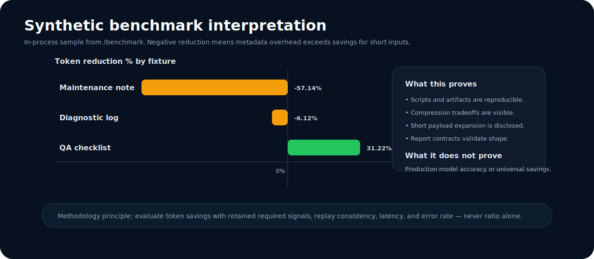
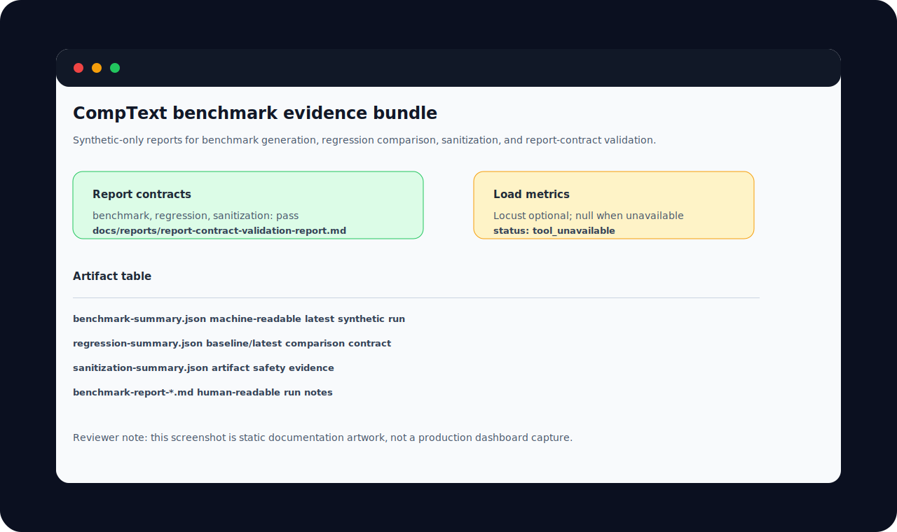

# Benchmarks

Benchmarks are presented as **engineering evidence**, not marketing claims. The project positions compression as a replayable pre-inference transformation, so benchmark interpretation combines token ratio, retained signals, replay consistency, latency, error rate, and artifact validity.



## Current benchmark posture

| Evidence source | Current interpretation |
|---|---|
| `/benchmark` in-process synthetic sample | Shows mixed token results and sub-millisecond local compression latency in mock/in-process conditions. |
| `docs/reports/benchmark-summary.json` | Latest machine-readable report can be generated even when optional Locust metrics are unavailable. |
| `docs/reports/regression-summary.json` | Compares available synthetic summaries and reports no clear regression when numeric p95/error-rate values are missing. |
| `docs/reports/report-contract-validation-report.md` | Confirms benchmark, regression, and sanitization summaries satisfy structural contracts. |

## Synthetic `/benchmark` sample

The API sample currently reports the following in-process synthetic cases. These are useful for sanity checks and tradeoff visibility. They are not production throughput results.

| Synthetic case | Original tokens | Compressed tokens | Reduction | Latency |
|---|---:|---:|---:|---:|
| Synthetic maintenance note | 21 | 33 | -57.14% | 0.286 ms |
| Synthetic diagnostic log | 49 | 52 | -6.12% | 0.107 ms |
| Synthetic QA checklist | 189 | 130 | 31.22% | 0.367 ms |
| Average | — | — | -10.68% | 0.253 ms |

### How to read negative reduction

Negative token reduction means the frame carries more overhead than the original text. That is expected for very short inputs because checksum, type, code, and metadata structure can outweigh compression savings. This is disclosed because the system should be trusted only when the tradeoff is visible.

## Before / after comparison model

| Before inference | After KVTC boundary | Review value |
|---|---|---|
| Verbose operational text enters model context directly. | Sanitized, typed frame enters triage/analysis. | Payload is inspectable before inference. |
| Token count is visible only at request time. | Original and compressed token estimates are recorded. | Savings or expansion can be measured. |
| Relevant codes may be buried in logs. | Codes are extracted into the `C` layer. | Required signals are easier to audit. |
| Replay depends on raw request capture. | Replay can use checksum-linked frame artifacts. | Review can avoid storing raw production payloads. |
| Regression evidence is ad hoc. | JSON and Markdown summaries are generated by scripts. | CI can validate artifact shape. |

## Methodology

1. Use synthetic-only payloads.
2. Generate benchmark summaries with `scripts/run_benchmarks.py`.
3. Generate regression summaries with `scripts/generate_regression_report.py`.
4. Run artifact sanitization with `scripts/sanitize_fixtures.py`.
5. Validate report contracts with `scripts/validate_report_contracts.py`.
6. Interpret metrics alongside limitations and notes.

## Metric interpretation

| Metric | Good use | Misuse to avoid |
|---|---|---|
| Token reduction | Compare fixtures and strategies; identify when compression helps or expands. | Claim universal savings from synthetic averages. |
| Semantic retention | Check required fields, codes, severity terms, and deterministic triage stability. | Assume lower token count means retained meaning. |
| Replay consistency | Compare checksums, rule hits, and report artifacts between runs. | Treat replay as equivalent to production audit compliance. |
| Latency | Track local preprocessing overhead and benchmark trends. | Compare single-run in-process latency to hosted model latency. |
| Error rate | Detect endpoint failures in load mode when tooling is available. | Fill missing optional load metrics with invented values. |

## Artifact screenshot



## Reproducibility

```bash
python -m py_compile scripts/run_benchmarks.py scripts/generate_regression_report.py scripts/sanitize_fixtures.py scripts/validate_report_contracts.py
python scripts/run_benchmarks.py
python scripts/generate_regression_report.py
python scripts/sanitize_fixtures.py
python scripts/validate_report_contracts.py
```

For live endpoint measurements, start the API separately and run the benchmark script with `--host http://localhost:8000`. Use `LLM_BACKEND=mock` when the goal is compression and report reproducibility rather than backend model evaluation.

## Known tradeoffs

- Short inputs may expand because structured metadata has fixed overhead.
- KVTC v7 can preserve richer event metadata while producing larger frames on short synthetic examples.
- Synthetic reports improve review safety but limit claims about real-world distributions.
- Optional load-testing metrics require Locust and a reachable target service.
- Semantic retention needs task-specific expected-field tests before production use.

## Limitations

This repository should be read as a systems-engineering showcase. It demonstrates pipeline design, artifact discipline, and validation mechanics. It does not provide a production accuracy benchmark, a comprehensive privacy guarantee, or a universal compression result.
