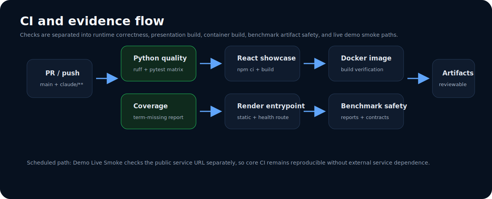

# Validation

Validation in this repository is designed to answer a narrow engineering question:

> Can the compression and replay pipeline produce safe, structured, reproducible artifacts that reviewers can inspect?

It is not a production accuracy certification and does not use real customer documents.

## Validation layers

| Layer | Command / artifact | What it checks | What it does not prove |
|---|---|---|---|
| Unit and API tests | `pytest tests/ --tb=short -q` | Endpoint behavior, agents, cache, telemetry, and KVTC behavior. | Production data coverage. |
| Syntax check | `python -m py_compile ...` | Benchmark/report tooling imports and parses. | Runtime service availability. |
| Benchmark report | `python scripts/run_benchmarks.py` | Synthetic report creation and summary schema. | Load-test metrics when Locust is unavailable. |
| Regression report | `python scripts/generate_regression_report.py` | Latest-vs-baseline summary and threshold interpretation. | A statistically significant performance trend. |
| Sanitization report | `python scripts/sanitize_fixtures.py` | Generated artifacts remain safe for review. | Exhaustive PII detection. |
| Contract validation | `python scripts/validate_report_contracts.py` | JSON summaries match expected report contracts. | Business correctness of every metric. |

## CI evidence flow

The GitHub Actions structure separates reviewer concerns:

| Workflow | Trigger | Evidence produced |
|---|---|---|
| CI | push / pull request | Ruff, tests, coverage, React build, Render entrypoint validation, Docker build. |
| Benchmark Checks | pull request / manual | Benchmark, regression, sanitization, and contract-validation artifacts. |
| Demo Live Smoke | scheduled / manual | External service smoke evidence without making core CI depend on the public demo. |

## Replay consistency checks

Replay consistency is interpreted through stable identifiers and deterministic outputs:

| Signal | Expected interpretation |
|---|---|
| Frame checksum stays the same for the same sanitized input and strategy | Compression result is replayable. |
| Triage priority and rule hits remain stable for the same input | Deterministic pre-LLM routing is stable. |
| Report-contract validation passes | Artifact shape is compatible with downstream automation. |
| Regression report has `regression_detected: false` | No threshold breach was identified from available numeric summaries. |
| Metric value is `null` with an explanatory note | Tooling was unavailable; the artifact is honest rather than fabricated. |

## Semantic retention interpretation

Semantic retention is workload-dependent. A credible retention review should inspect whether required signals remain in the frame, not simply whether token count is lower.

| Scenario | Required retained signals |
|---|---|
| Diagnostic log | OBD codes, active symptoms, safety-critical words, mileage or timestamp when present. |
| Shift report | Station, deviation type, blocked step, timestamp, severity terms. |
| QA checklist | Defect category, part identifier, severity, disposition. |
| Supply-chain update | Supplier, part number, delay reason, ETA, duplicate references. |

## Validation limitations

- Current committed benchmark summaries are synthetic and intentionally conservative.
- Optional load metrics can be unavailable when Locust is not installed.
- Synthetic fixtures do not prove production distribution coverage.
- Retention is not yet backed by a full gold-set harness with expected-field assertions.
- Model quality depends on backend configuration and is not represented by mock-mode tests.

## Recommended reviewer checklist

1. Run the unit test and report validation commands.
2. Inspect a `/compress` response for frame shape, checksum, token estimates, and latency.
3. Inspect `/triage` outputs for rule-hit explainability.
4. Review `docs/reports/benchmark-summary.json` and `docs/reports/regression-summary.json` before citing performance.
5. Treat null metrics and negative token savings as disclosed tradeoffs, not failures hidden by presentation.
